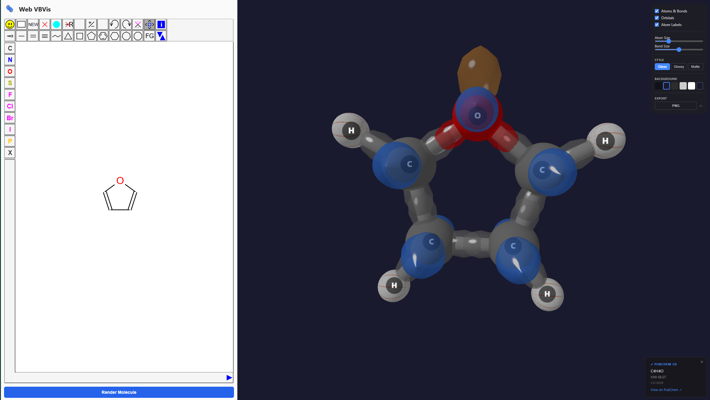
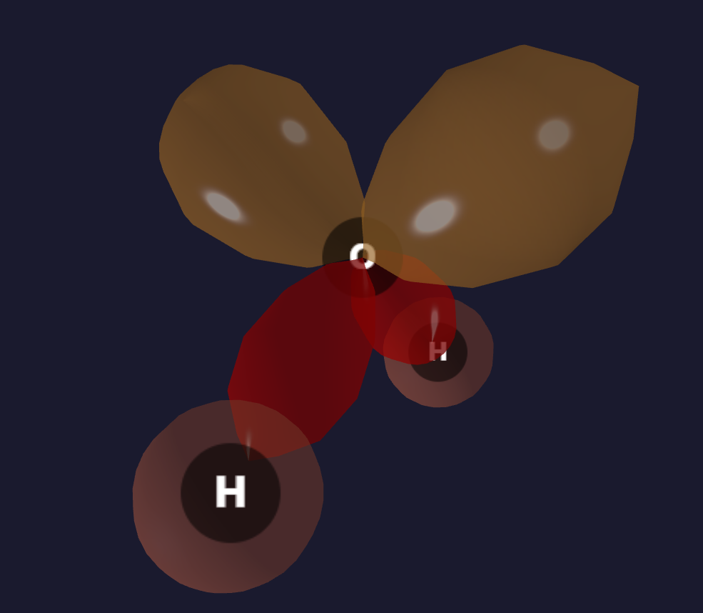
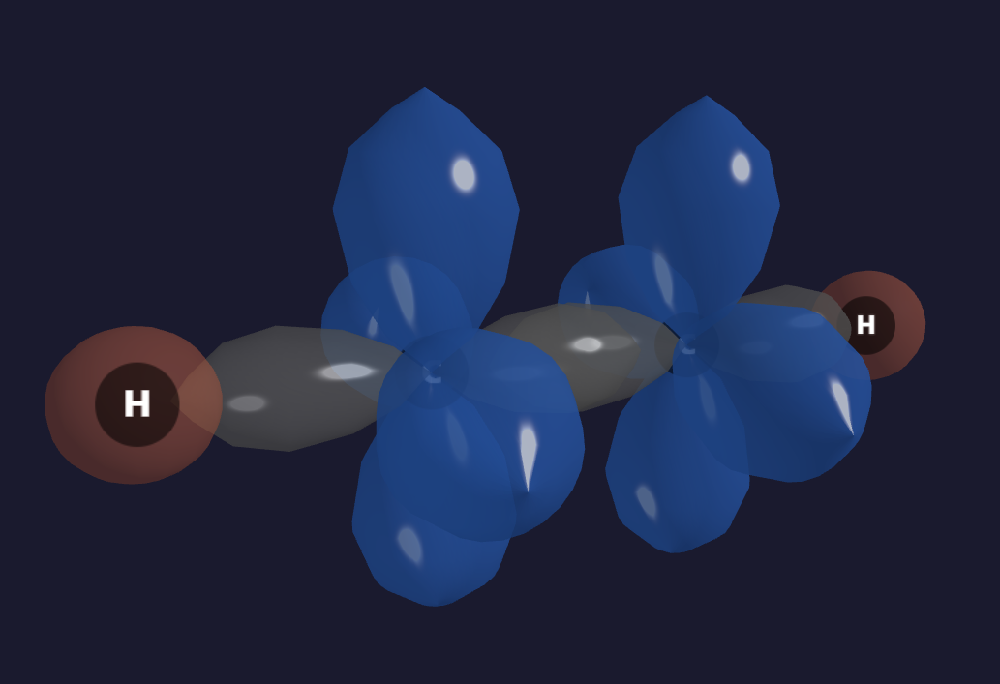

# ⚛️ Valence: Interactive Valence Bond Visualization

[](https://exergonic.github.io/valence)
[](https://github.com/exergonic/valence/releases)
[](https://opensource.org/licenses/MIT)

**Valence** is a browser-based, interactive 3D molecular orbital viewer built for chemical education. It dynamically classifies hybridization, orients lone pairs, and renders valence bond orbitals (σ lobes, π lobes, p atomic orbitals) directly from sketched or imported molecules. 

<div align="center">
  
  <br/>
  
  
</div>

---
## 📥 Platforms & Distribution

| Platform | Access | Details |
|----------|--------|---------|
| 🌐 **Web** | [GitHub Pages](https://exergonic.github.io/valence) | Zero installation required. Runs entirely in modern browsers. |
| 🪟 **Windows** | [Releases](https://github.com/exergonic/valence/releases) | MSI installer via Tauri v2. Self-contained webview wrapper with identical render pipeline, zero servers, and zero telemetry. |

---
## 🎯 Pedagogical Scope

Built specifically for the classroom, Valence embraces a purely geometric and algorithmic approach to illustrate VSEPR rules and local coordination, making it ideal for teaching undergraduate general and organic chemistry.

| 📐 What It Is | 🧮 What It Is NOT |
| :--- | :--- |
| **Geometric & Algorithmic:** Infers orbital orientations from local coordination numbers and atomic positions based on VSEPR principles. | **Quantum Mechanical:** Does *not* perform *ab initio* VB wavefunction or resonance calculations. |
| **Pedagogical:** Designed to bridge the gap in chemical education by illustrating bonding concepts and 3D geometry. | **Electronic Structure Tool:** Does *not* compute MOs, electron density matrices, or solve the Schrödinger equation. |

---

## ✨ Core Capabilities

*   **🧠 Hybridization Engine:** Dynamically assigns sp / sp² / sp³ states from measured bond angles. Includes geometry-derived conjugation detection (e.g., furan O, aniline N, amide N, H₂SO₄ O).
*   **🌐 Robust 3D Embedding:** Leverages PubChem PUG REST (MMFF94-optimized) as a primary engine, with RDKit.js ETKDG (client-side WASM) and a custom graph-walk embedder + torsion optimizer as seamless fallbacks.
*   **🎨 Advanced Orbital Rendering:** Powered by THREE.js. Utilizes precise `LatheGeometry` lobes to visualize σ, π, p, and lone pair orbitals.
*   **🧭 p-AO Directionality:** Automatically orientates all π-system p-orbitals perpendicular to the σ plane, forcing parallel alignment across conjugated networks.
*   **📸 Quick Export:** Seamlessly capture and export 2× resolution PNG snapshots of the current viewport for lectures or assignments.

---

## 🚀 Quick Start

To run the development server locally:

```bash
# Install dependencies
npm install

# Start the dev server
npm run dev
```
Open `http://localhost:5173`, draw a molecule in the JSME panel, and click **Render Molecule**.

### Command Reference

| Task | Command |
|------|---------|
| Start dev server | `npm run dev` |
| Build for web | `npm run build` |
| Preview web build | `npm run preview` |
| Run test suite | `npm test` |
| Test watch mode | `npm run test:watch` |
| Desktop dev (Tauri) | `npm run tauri:dev` |
| Desktop build (Tauri) | `npm run tauri:build` |
| Run linter | `npm run lint` |
| Typecheck | `npx tsc --noEmit` |

---

## ⚙️ Architecture & Pipeline

Valence features a modern, lightweight frontend stack built with **Vite** and **TypeScript**. The 3D scene graph is handled by vanilla **Three.js** (no React overhead), sketching is powered by **JSME**, and the desktop wrapper utilizes **Tauri v2** for a self-contained, telemetry-free Windows environment.

### Data Pipeline

```text
[JSME MOL Block] ➔ Parse Atoms/Bonds ➔ Hybridization Engine ➔ 3D Embedder ➔ Torsion Optimizer ➔ [Three.js Render]
```

1. **Input:** Draw a molecule in the JSME panel (or select a pre-built example).
2. **Primary 3D:** Attempt PubChem PUG REST for MMFF94-optimized coordinates.
3. **WASM Fallback:** If PubChem is unreachable, utilize RDKit.js ETKDG + MMFF94 (~7 MB footprint).
4. **Local Fallback:** If both fail, deploy the internal graph-walk embedder and torsion optimizer (adding implicit hydrogens as needed).
5. **Render:** Classify hybridization, map orbital geometry, and push to the Three.js canvas.

### Key Modules

| Directory / File | Purpose |
|------------------|---------|
| `src/mol-parser/` | Custom fixed-width MOL block parser (~40 lines, zero external dependencies). |
| `src/hydrogens/` | Algorithm to inject missing implicit hydrogens if PubChem 3D is unavailable. |
| `src/hybridization/` | Analyzes measured bond angles (rather than basic connectivity) to assign true hybridization. |
| `src/embedder/` | Places 3D coordinates via graph-walking and hybridization vectors. |
| `src/embedder/torsions.ts`| Optimizes torsions to ensure staggered alkane conformations. |
| `src/services/resolve3d.ts`| Interface for fetching MMFF94 coordinates from the PubChem PUG REST API. |
| `src/scene/` | Core Three.js logic for rendering atoms, bonds, and lighting. |
| `src/orbitals/` | Generates accurate `LatheGeometry` for individual sp, sp², and sp³ lobes. |

---


---

## 📖 Citation

If you use Valence in your curriculum or presentations, please cite:

> **Valence v0.5.0 — Valence Bond Visualization (2026).**
> McCann, B. W. *https://github.com/exergonic/valence*