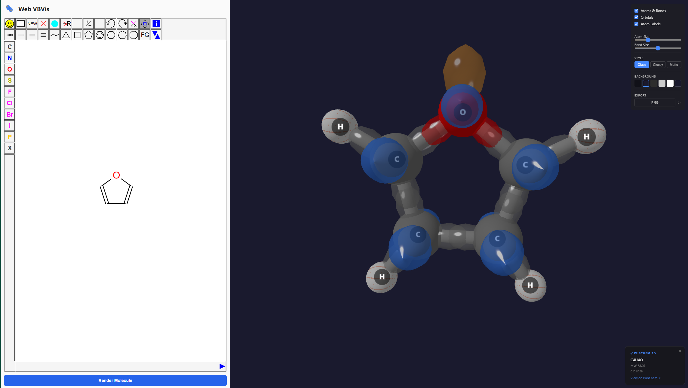
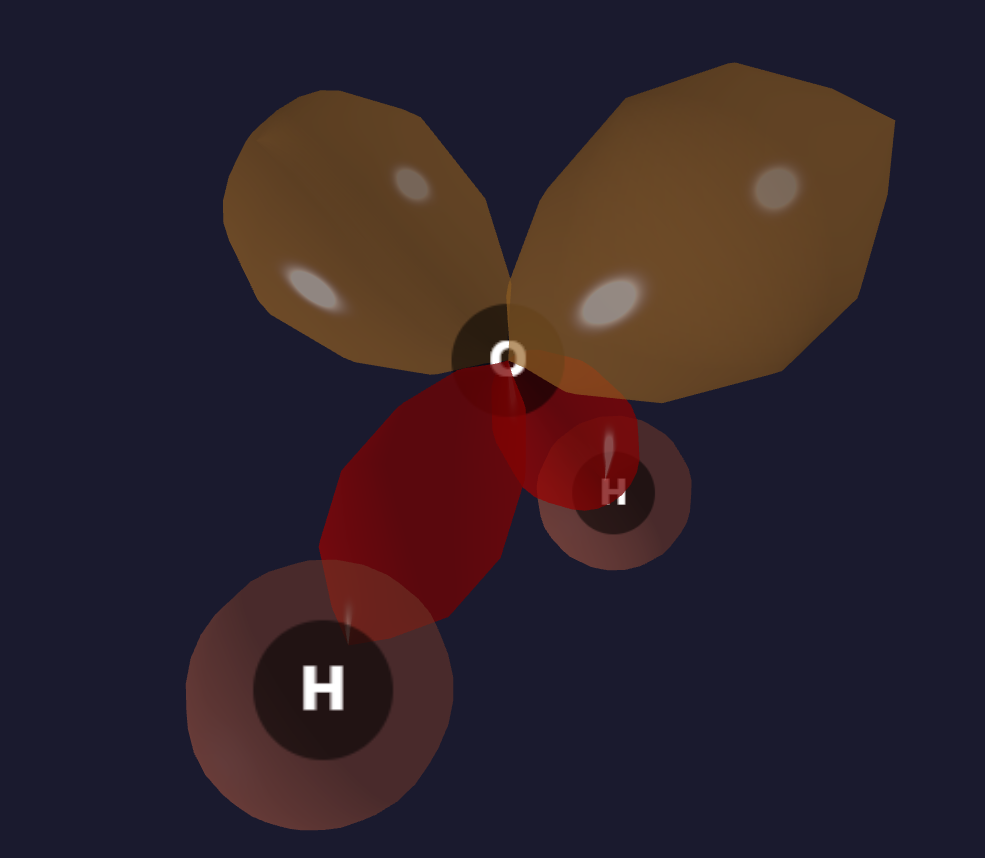
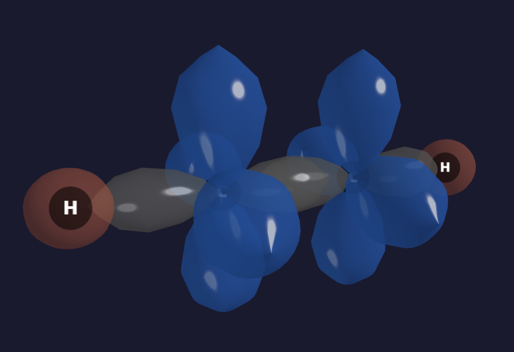
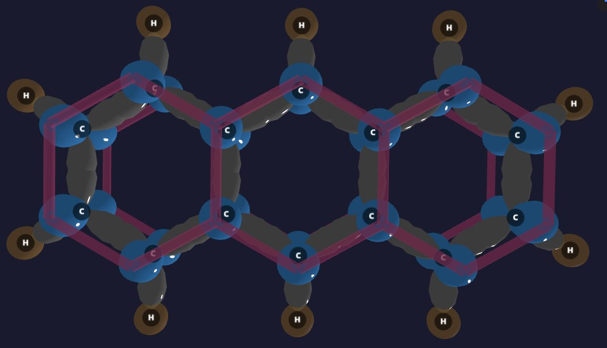
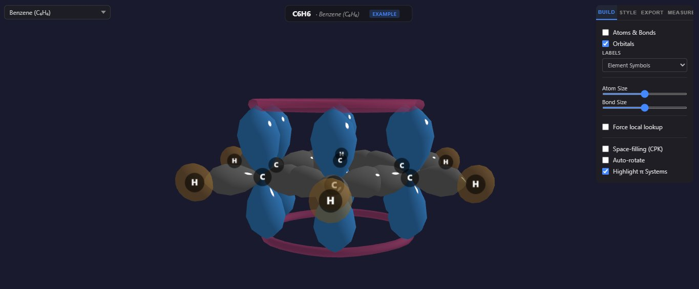
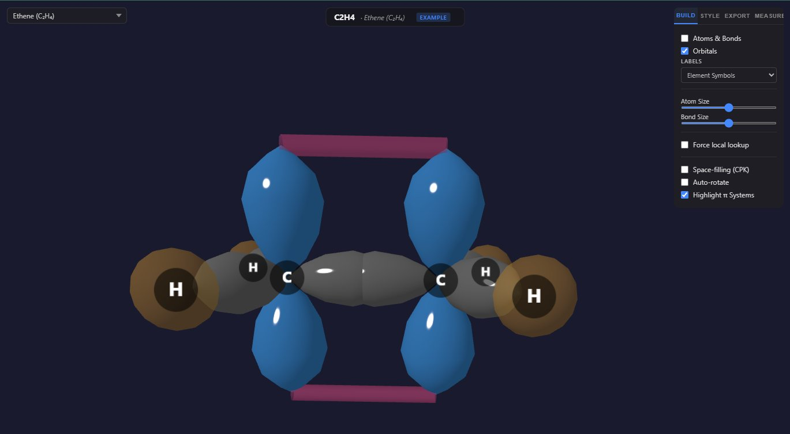
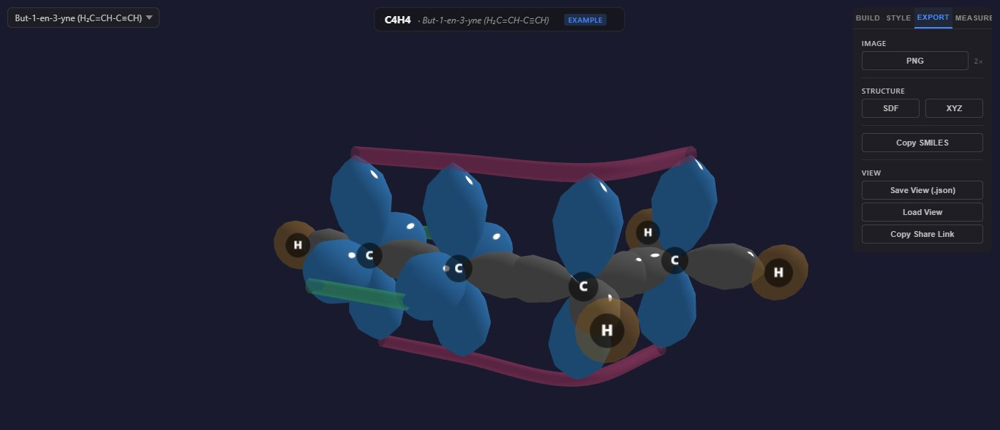

# ⚛️ Valence: Interactive Valence Bond Visualization

[](https://exergonic.github.io/valence)
[](https://github.com/exergonic/valence/releases)
[](https://opensource.org/licenses/MIT)

**Valence** is a browser-based, interactive 3D molecular orbital viewer built for chemical education. It dynamically classifies hybridization, orients lone pairs, and renders valence bond orbitals (σ lobes, π lobes, p atomic orbitals) directly from sketched or imported molecules. 

<div align="center">
  
  <br/>
  
  
</div>

---
## 📥 Platforms & Distribution

| Platform | Access | Details |
|----------|--------|---------|
| 🌐 **Web** | [GitHub Pages](https://exergonic.github.io/valence) | Zero installation required. Runs entirely in modern browsers. |
| 🪟 **Windows** | [Releases](https://github.com/exergonic/valence/releases) | MSI installer via Tauri v2. Self-contained webview wrapper with identical render pipeline, zero servers, and zero telemetry. |

---
## 🎯 Pedagogical Scope

Built specifically for the classroom, Valence embraces a purely geometric and algorithmic approach to illustrate VSEPR rules and local coordination, making it ideal for teaching undergraduate general and organic chemistry.

| 📐 What It Is | 🧮 What It Is NOT |
| :--- | :--- |
| **Geometric & Algorithmic:** Infers orbital orientations from local coordination numbers and atomic positions based on VSEPR principles. | **Quantum Mechanical:** Does *not* perform *ab initio* VB wavefunction or resonance calculations. |
| **Pedagogical:** Designed to bridge the gap in chemical education by illustrating bonding concepts and 3D geometry. | **Electronic Structure Tool:** Does *not* compute MOs, electron density matrices, or solve the Schrödinger equation. |

---

## ✨ Core Capabilities

*   **🧠 Hybridization Engine:** Assigns sp / sp² / sp³ / sp³d / sp³d² states by counting electron domains (σ bonds + lone pairs) from the molecular graph — never from measured angles, which are the *output* of geometry, not its identity. Includes conjugation detection (e.g., phenol O, amide N, H₂SO₄ O) with a geometric promotion gate.
*   **🌐 Robust 3D Embedding:** Kekulizes JSME's aromatic SMILES (monocyclic rings → explicit bonds, so antiaromatic molecules like cyclobutadiene resolve correctly), then tries PubChem PUG REST for MMFF94-optimized coordinates, then the NIH CACTUS (CIR) resolver — each result validated against the sketch's heavy-atom bond graph. The in-house fallback (implicit hydrogens + graph-walk embedder + MMFF94 refinement via the vendored `mmff94-ts` library, in a Web Worker) produces MMFF94-quality geometry with no native dependencies.
*   **🎨 Advanced Orbital Rendering:** Powered by THREE.js. Utilizes precise `LatheGeometry` lobes to visualize σ, π, p, and lone pair orbitals.
*   **🧭 p-AO Directionality:** Automatically orientates all π-system p-orbitals perpendicular to the σ plane, forcing parallel alignment across conjugated networks.
*   **⚡ Generic-Parameter Warnings:** When the local MMFF94 path must use generic parameters (hypervalent centers like PCl₅/SF₆, elements outside the MMFF94 type space), the status popup warns that the refined geometry is approximate — validated against the 761-molecule MMFF94 suite so it never false-fires on covered chemistry.
*   **📸 Quick Export:** Seamlessly capture and export 2× resolution PNG snapshots of the current viewport for lectures or assignments.

---

## 📸 Gallery

A few stills from recent feature work — hybridization and frontier-orbital teaching views, delocalized π-system detection, and fused-ring π systems. Captured directly from the app; click any image to enlarge.

<div align="center">

| | |
| :-: | :-: |
| **Fused-ring π system**<br/>anthracene<br/> | **π-system detection**<br/>conjugated diene highlighted<br/> |
| **Aromatic π system**<br/>benzene p-orbitals<br/> | **Fused-ring π systems**<br/>multi-ring delocalization<br/> |
|  | |

</div>

---

## 🚀 Quick Start

To run the development server locally:

```bash
# Install dependencies
npm install

# Start the dev server
npm run dev
```
Open `http://localhost:5173`, draw a molecule in the JSME panel, and click **Render Molecule**.

### Command Reference

| Task | Command |
|------|---------|
| Start dev server | `npm run dev` |
| Build for web | `npm run build` |
| Preview web build | `npm run preview` |
| Run test suite | `npm test` |
| Test watch mode | `npm run test:watch` |
| Desktop dev (Tauri) | `npm run tauri:dev` |
| Desktop build (Tauri) | `npm run tauri:build` |
| Run linter | `npm run lint` |
| Typecheck | `npx tsc --noEmit` |

---

## ⚙️ Architecture & Pipeline

Valence features a modern, lightweight frontend stack built with **Vite** and **TypeScript**. The 3D scene graph is handled by vanilla **Three.js** (no React overhead), sketching is powered by **JSME**, and the desktop wrapper utilizes **Tauri v2** for a self-contained, telemetry-free Windows environment.

### Data Pipeline

```text
[JSME MOL + SMILES] ➔ Kekulize Aromatic SMILES ➔ Validate vs Sketch ➔ 3D Embedder + MMFF94 Refinement ➔ [Three.js Render]
```

1. **Input:** Draw a molecule in the JSME panel (or select a pre-built example — methane through water, the hypervalent PCl₅ trigonal bipyramid and SF₆ octahedron, and more).
2. **Kekulize:** JSME's `smiles()` emits aromatic lower-case SMILES; monocyclic aromatic rings are rewritten to explicit Kekulé single/double bonds so the query is unambiguous (an antiaromatic ring like cyclobutadiene otherwise resolves to the saturated cycloalkane at PubChem).
3. **Primary 3D:** Attempt PubChem PUG REST for MMFF94-optimized coordinates; the returned SDF is accepted only when its heavy-atom bond graph matches the sketch.
4. **CIR Fallback:** If PubChem has no structure (e.g., its conformer generator fails) or the result mismatches, try the NIH CACTUS (CIR) resolver with the same validation.
5. **Local Fallback:** If both fail, run the in-house pipeline in a Web Worker: add implicit hydrogens, embed 3D coordinates with the graph-walk embedder, then refine with MMFF94 (the vendored `mmff94-ts` library, L-BFGS, 200-iteration budget). The status popup warns when the molecule must run on generic MMFF94 parameters.
6. **Render:** Classify hybridization, map orbital geometry, and push to the Three.js canvas.

### Key Modules

| Directory / File | Purpose |
|------------------|---------|
| `src/mol-parser/` | Custom fixed-width MOL block parser (~40 lines, zero external dependencies). |
| `src/chem/` | Chemistry engine: `hybridize.ts` (domain-count hybridization, sp → sp³d²), `classify.ts` + `orient-pi.ts` (lone pairs, π directionality, the conjugation promotion gate), `fill-hydrogens.ts` (implicit-H filling), `kekulize-smiles.ts` (aromatic SMILES → explicit Kekulé bonds for the PubChem query). |
| `src/geometry/` | 3D coordinate acquisition: `resolve3d.ts` (PubChem → CIR, each result validated), `validate-structure.ts` (heavy-atom bond-graph mismatch guard), `place3d.ts` + `torsions.ts` (graph-walk embedder), `mmff-refine.ts` + `local-geometry.ts` (MMFF94 refinement in a Web Worker), `parameter-warnings.ts` (generic-parameter feedback). |
| `src/render/` | Core Three.js logic: atoms, bonds, lighting, orbital lobes (`lobes.ts` LatheGeometry profiles), `rebuild.ts` state-driven rebuild. |
| `src/ui/` | Control panel, JSME panel wiring, the examples list (`examples.ts`), tooltip. |
| `src/utils/` | Vector math (`vec3.ts`) and pure lone-pair direction geometry (`lone-pairs.ts`). |

The MMFF94 engine is consumed from `vendor/mmff94-ts-0.1.0-alpha.1.tgz` (a committed, self-contained bundle of the [mmff94-ts](https://github.com/exergonic/mmff94-ts) library — zero runtime dependencies; Vite embeds it into the worker chunk at build time).

---


---

## 📖 Citation

If you use Valence in your curriculum or presentations, please cite:

> **Valence v0.7.0 — Valence Bond Visualization (2026).**
> McCann, B. W. *https://github.com/exergonic/valence*