<div align="center">

# ⚛️ Valence

### Draw a molecule. See its bonding, from Lewis structure to molecular orbitals.

**VSEPR hybrids and lone pairs, partial charges and the electrostatic potential, and the bonds and molecular orbitals of a real calculation, all from one sketch. In your browser, in seconds.**

[](https://exergonic.github.io/valence)
&nbsp;
[](https://github.com/exergonic/valence/releases)

[](https://opensource.org/licenses/MIT)


<br/>

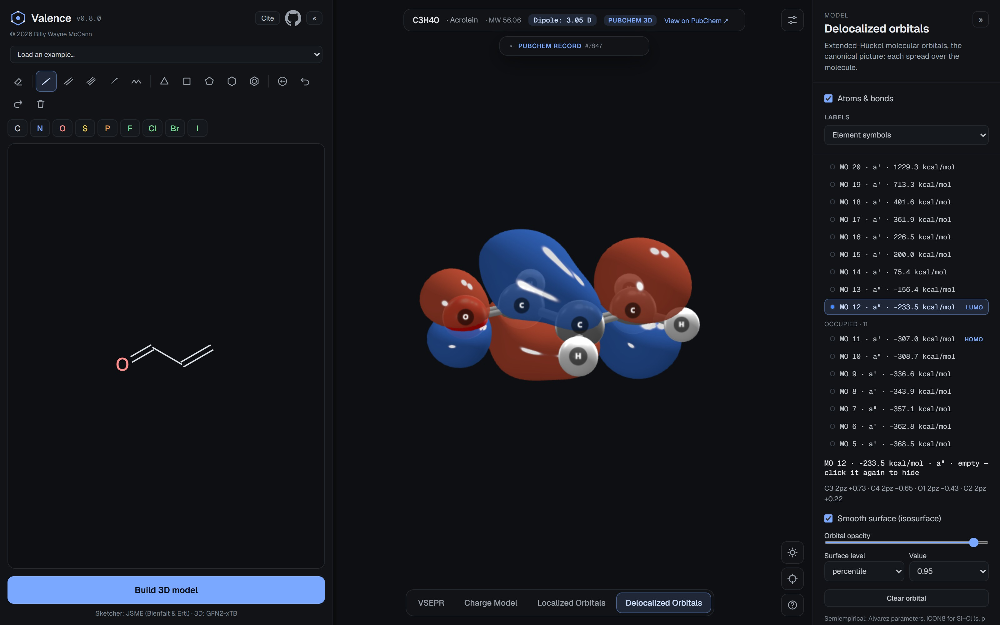

<sub>Acrolein, sketched on the left and built in 3D. Its LUMO is the π* orbital spread over all four atoms of the conjugated system, shown beside the extended-Hückel level ladder.</sub>

</div>

---

## One molecule, four models of bonding

Valence is built around a single idea: **every model of the chemical bond is a lens, and a student should be able to look through all of them at the same molecule.** Sketch formaldehyde once, then switch views:

<div align="center">
<table>
<tr>
<td align="center" width="25%">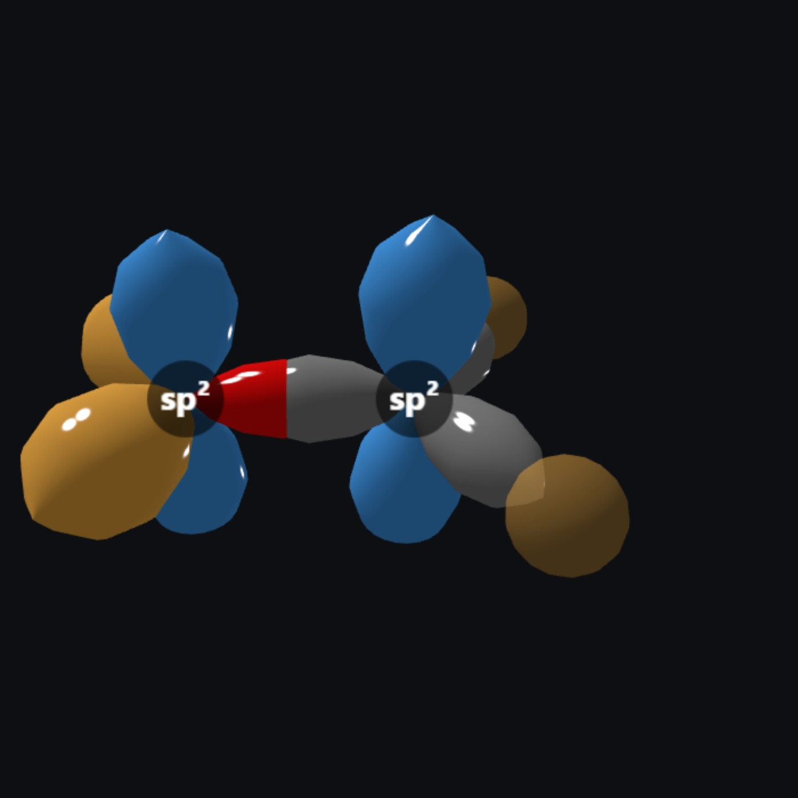</td>
<td align="center" width="25%">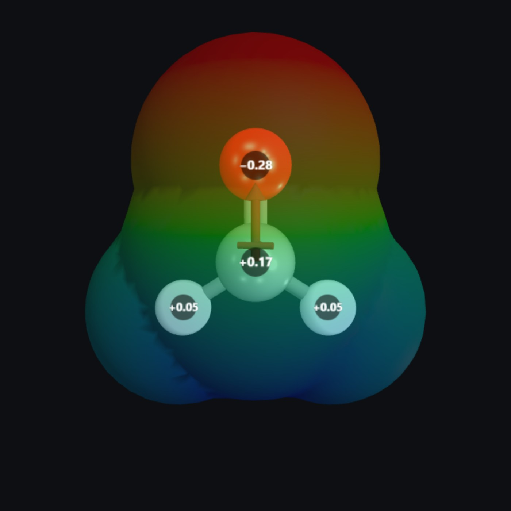</td>
<td align="center" width="25%">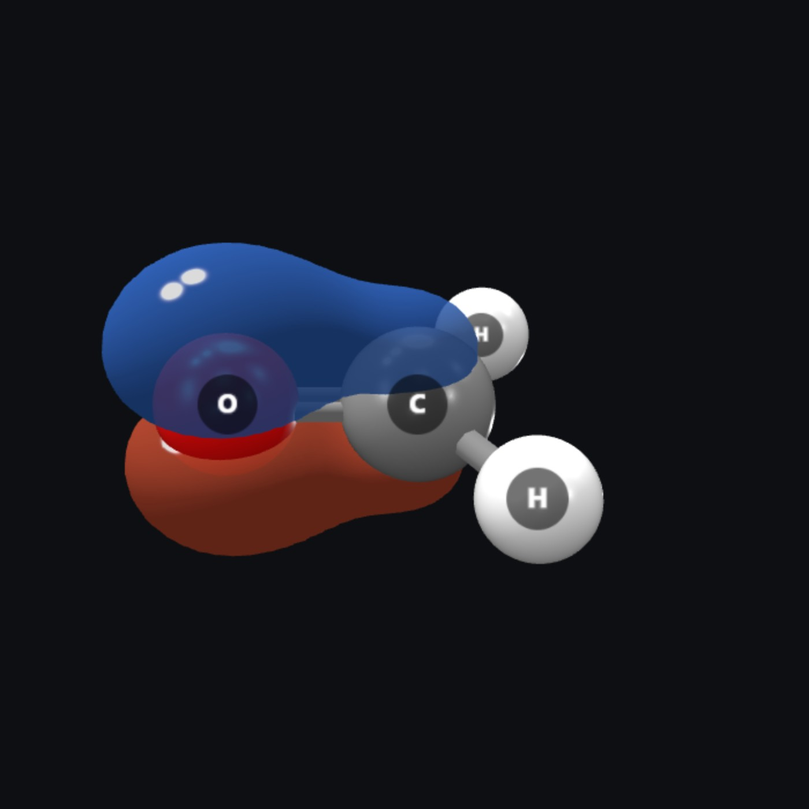</td>
<td align="center" width="25%">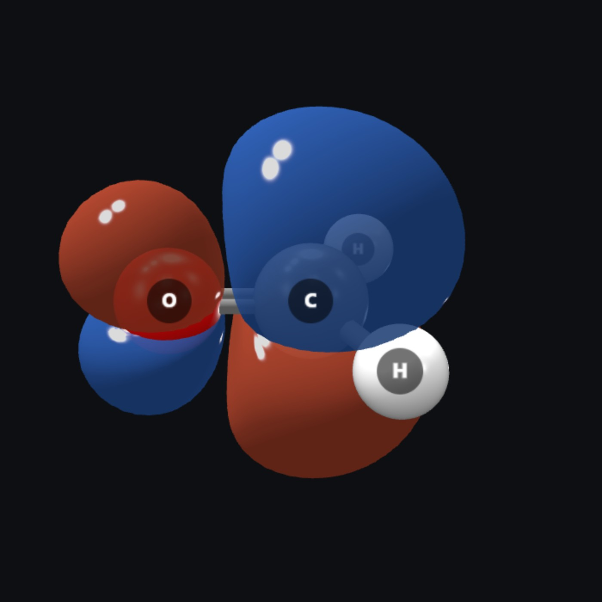</td>
</tr>
<tr>
<td align="center"><b>VSEPR</b><br/><sub>Count electron domains, choose a hybridization: two sp² centres, oxygen's lone pairs, and the p orbitals left over for π.</sub></td>
<td align="center"><b>Charge Model</b><br/><sub>Partial charges, the electrostatic potential surface, and the dipole they add up to: oxygen is the electron-rich end.</sub></td>
<td align="center"><b>Localized Orbitals</b><br/><sub>The calculated orbitals rearranged into the Lewis picture: here, the C=O π bond, one lobe above the axis and one below.</sub></td>
<td align="center"><b>Delocalized Orbitals</b><br/><sub>The canonical molecular orbitals: the π* LUMO, with its node between C and O. Where a nucleophile attacks.</sub></td>
</tr>
</table>
</div>

The bond a student draws as a line in a Lewis structure becomes a pair of orbitals, one bonding and one antibonding. The lone pairs counted in VSEPR become orbitals you can click on. The HOMO and LUMO stop being abbreviations. Valence was made to get a student there in one sitting.

---

## The ethos

**Real chemistry, not cartoons.** The pictures come from calculations. Geometries are optimised with [GFN2-xTB](https://pubs.acs.org/jctcce/article/15/3/1652/975266/GFN2-xTB-An-Accurate-and-Broadly-Parametrized-Self), orbitals come from extended Hückel theory, and bonds and lone pairs from Pipek–Mezey localization of those orbitals. A degenerate pair comes out as the textbook partners, labelled with its Mulliken symmetry (e1g, b2, a′).

**Honest about what it is.** Every method is named where its result appears, along with its limits. Semiempirical is labelled semiempirical. A structure that did not converge says so. A wrong structure is never shown silently: a fetched conformer that doesn't match your sketch is rejected, and an optimisation that broke a bond is set aside.

**The sketch is the specification.** A drawn wedge or hash is honoured through the optimisation. A ring keeps its stereochemistry, and a cis double bond stays cis.

**Good enough in seconds beats perfect in minutes.** This is a teaching tool, used live in front of a student. Most molecules build in a few seconds, and every optimisation has a 30-second budget.

**Nothing to install, nothing to send.** It's a static web page: the quantum chemistry runs in WebAssembly in your own browser, and no server sees your molecules.

---

## A gallery

<div align="center">
<table>
<tr>
<td align="center" width="33%">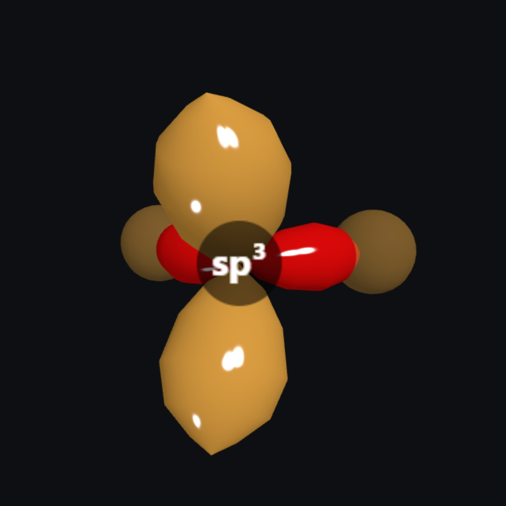<br/><b>Water's lone pairs</b><br/><sub>Four electron domains, two of them lone pairs: sp³ oxygen, and the bent shape that follows.</sub></td>
<td align="center" width="33%">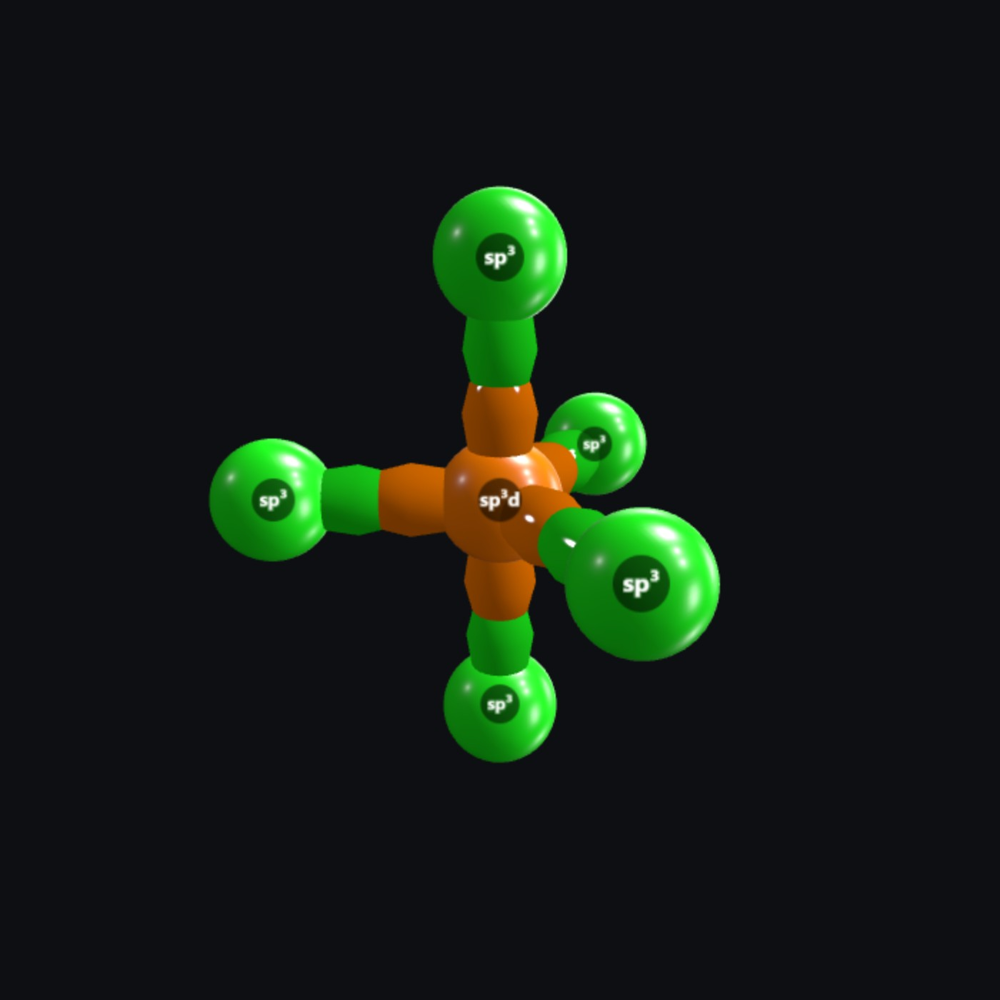<br/><b>Hypervalent PCl₅</b><br/><sub>A trigonal bipyramid, sp³d at phosphorus. Built locally, GFN2-xTB makes the axial bonds the longer pair, as they are; a force field gets them backwards.</sub></td>
<td align="center" width="33%"><br/><b>Benzene's e1g HOMO</b><br/><sub>One of the degenerate pair, symmetry-adapted and labelled by its irreducible representation.</sub></td>
</tr>
<tr>
<td align="center">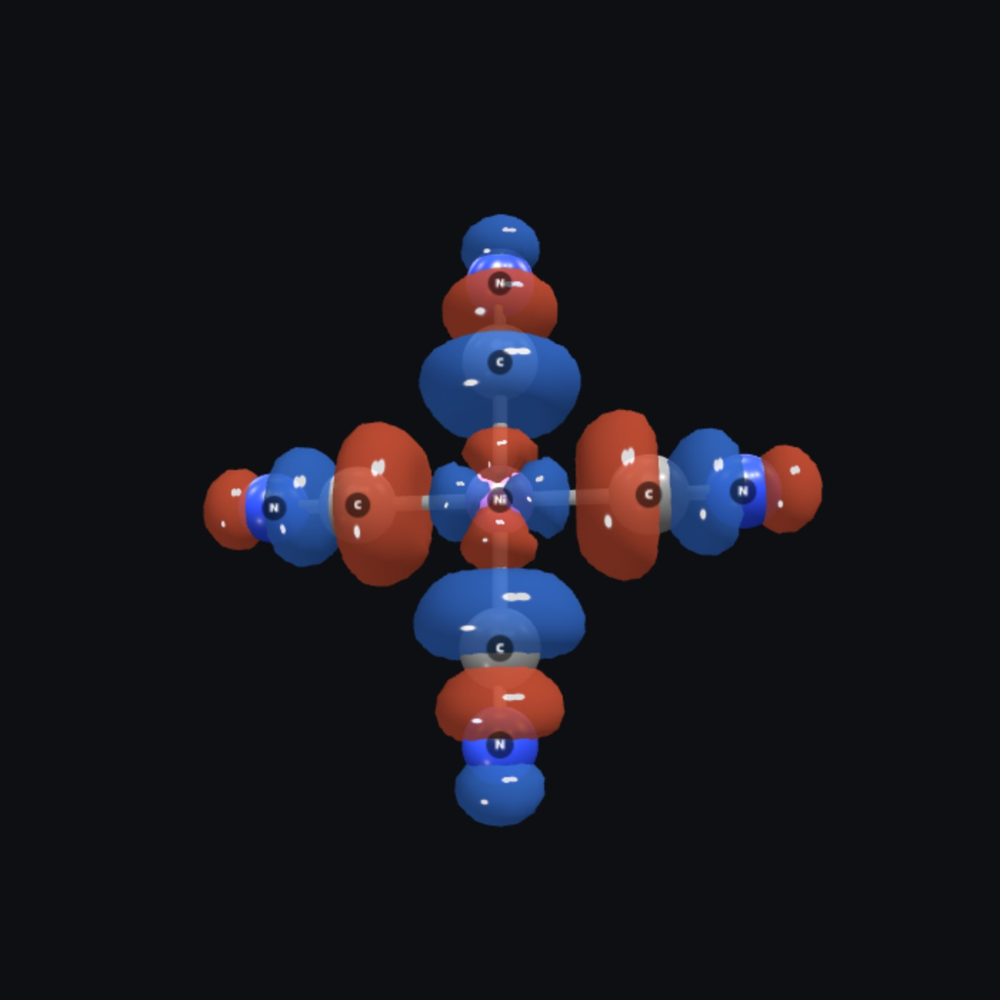<br/><b>The empty d<sub>x²−y²</sub> of [Ni(CN)₄]²⁻</b><br/><sub>Square-planar d⁸: the σ* orbital aimed straight at the four ligands is the one left empty, which is why the complex is square planar.</sub></td>
<td align="center">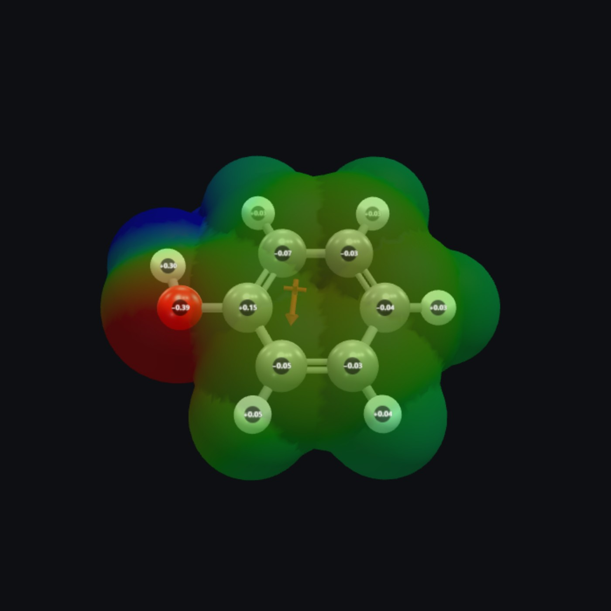<br/><b>Phenol's electrostatic potential</b><br/><sub>GFN2-xTB charges on every atom, the potential they make, and the dipole.</sub></td>
<td align="center">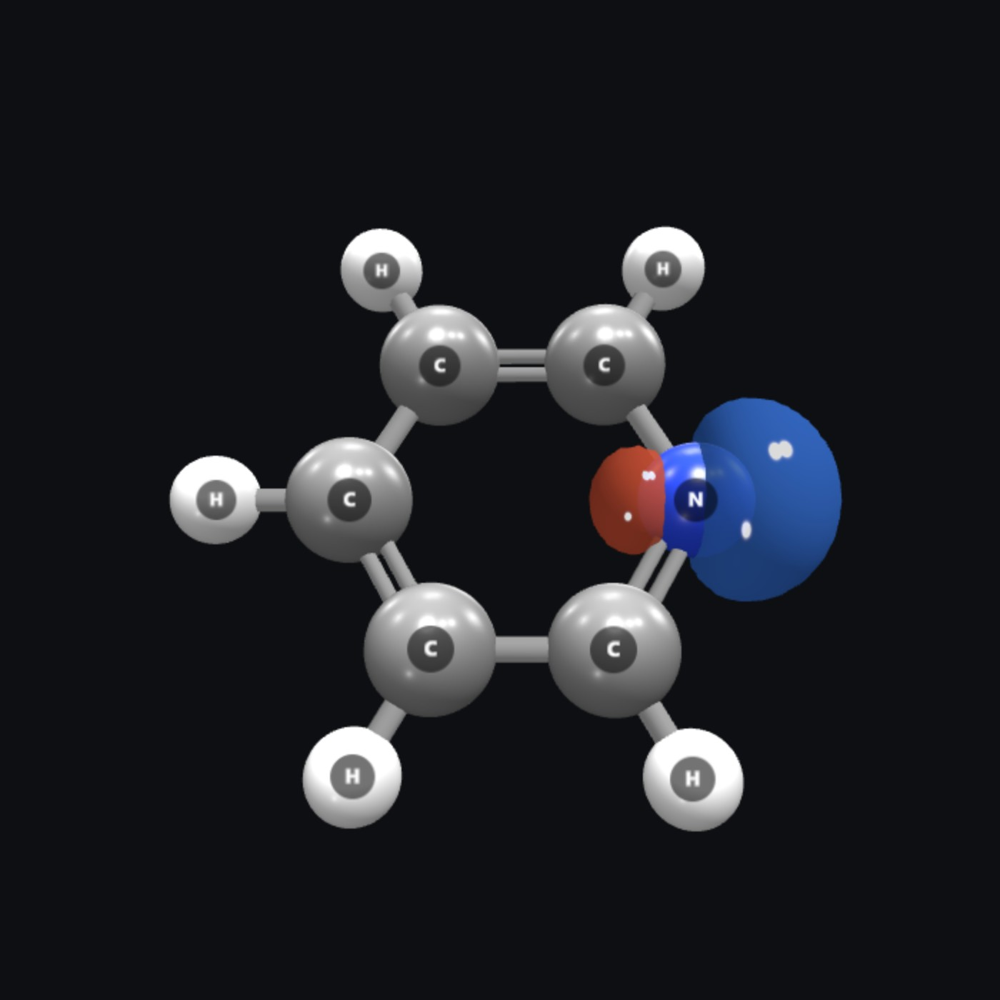<br/><b>Pyridine's lone pair</b><br/><sub>In the plane of the ring, not part of the aromatic π system, and the reason pyridine is a base.</sub></td>
</tr>
</table>
</div>

---

## What it does

**Sketch anything.** The sketcher is JSME with Valence's own toolbar over it: bonds, chains, rings, charges, wedges, and an element palette. Or start from one of 18 examples, from methane and benzene to diborane, SF₆, and a pair of nickel complexes that tell the ligand-field story: tetrahedral triplet [NiCl₄]²⁻ (Jahn–Teller distorted, and it says so) beside square-planar singlet [Ni(CN)₄]²⁻.

**Get a real 3D structure.** Valence first asks PubChem for a structure, then NIH CACTUS, and accepts one only if its bond graph and charge match your sketch. Failing both, it builds the molecule locally:
- it embeds the sketch in 3D, with anti chains, the drawn cis/trans, and square-planar d⁸ metals;
- it optimises with **GFN2-xTB** in a Web Worker, using the OCC engine compiled to WebAssembly and its Berny optimiser in internal coordinates;
- for small molecules, it checks each converged point against the exact gradient and the Hessian, so a saddle point is pushed off and re-optimised instead of being called a minimum.

**See the VSEPR picture.** Hybridization comes from counting electron domains in the bond graph, never from measured angles, which are the output of the geometry, not its cause. The view draws σ hybrids, lone pairs, and p orbitals aligned across conjugated systems, then labels them by element, orbital type, hybridization or charge. It covers sp through sp³d², conjugated lone pairs (the amide N, the phenol O), ligands bonded to metals, and π-system highlighting.

**See the charges.** GFN2-xTB Mulliken charges by default (or MMFF94 bond-charge increments, if you prefer) feed the charge labels, the ESP surface and the dipole together, so all three describe one distribution.

**See the orbitals.**
- Extended Hückel molecular orbitals, the delocalized view, as a ladder of levels with HOMO and LUMO marked and Mulliken symmetry labels; the transition metals have their d orbitals.
- Pipek–Mezey localized orbitals, the bonds-and-lone-pairs view: σ, π, lone pair, σ* and π*, ordered by energy. Pick a filled one and an empty one to compare them.
- Any orbital drawn as a smooth isosurface with its two phases, and its AO composition listed beside it.

**Make it look the way you teach.**
- Three themes: Graphite, Steel and Light.
- Four atom styles and four orbital finishes.
- Space-filling mode, auto-rotate, and distance, angle and dihedral measurement.
- On-canvas annotations, and the right-click menu.

**Take it with you.** Export PNG at 2× resolution, SDF (formal charges kept) or XYZ, or copy any of them to the clipboard. You can also save the whole view to a file or a shareable link.

<div align="center">
<table>
<tr>
<td align="center" width="33%">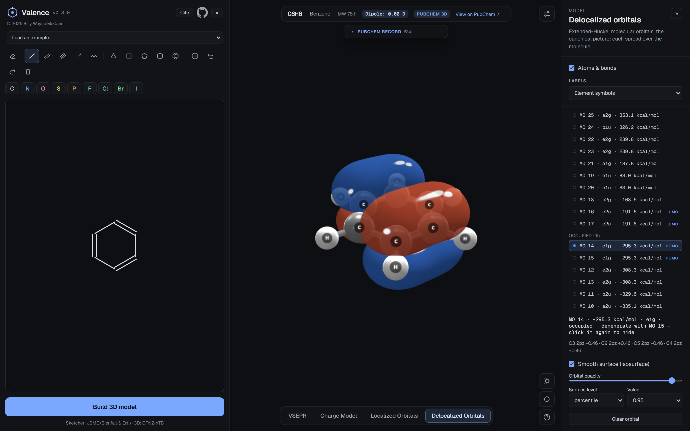<br/><sub><b>Graphite</b></sub></td>
<td align="center" width="33%">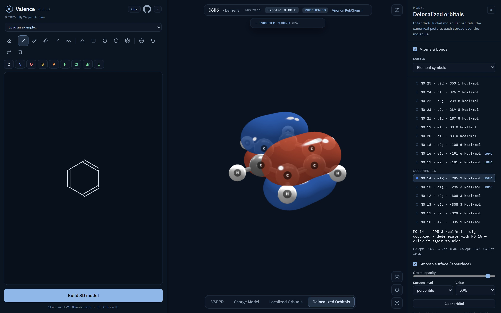<br/><sub><b>Steel</b></sub></td>
<td align="center" width="33%">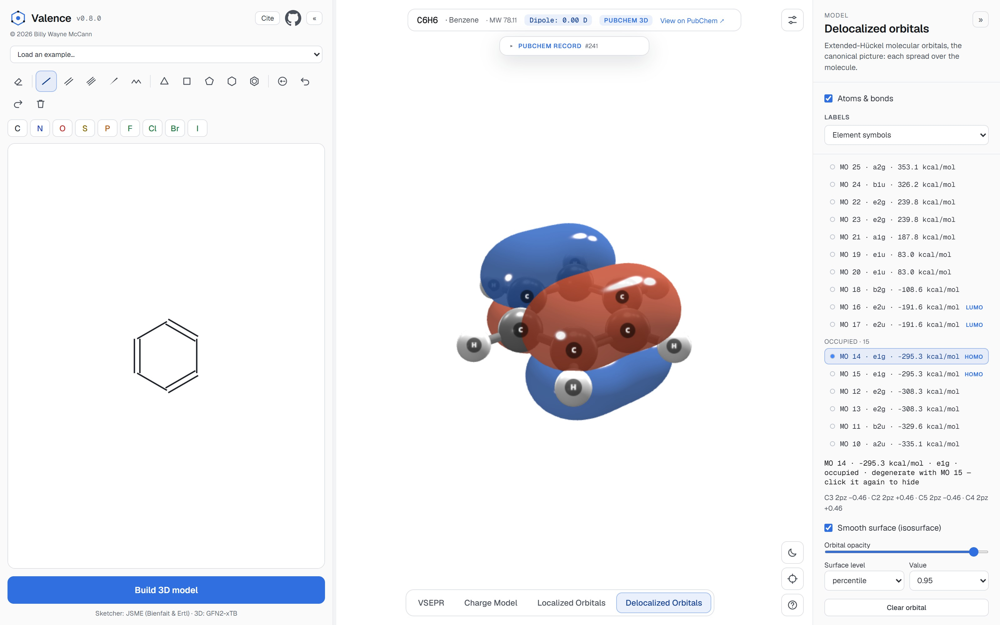<br/><sub><b>Light</b></sub></td>
</tr>
</table>
</div>

---

## Get it

| Platform | Where | |
|---|---|---|
| 🌐 **Web** | [exergonic.github.io/valence](https://exergonic.github.io/valence) | Nothing to install. Runs in any modern browser; the computation happens on your machine. |
| 🪟 **Windows** | [Releases](https://github.com/exergonic/valence/releases) | An installer built with Tauri v2: the same app in its own window, with no telemetry. |

### Keyboard

| Key | Does |
|---|---|
| <kbd>Enter</kbd> | Build the 3D model from the sketch |
| <kbd>1</kbd>–<kbd>9</kbd> | Load an example |
| <kbd>R</kbd> | Reset the view |
| <kbd>O</kbd> | Show or hide the model panel |
| <kbd>B</kbd> | Dock or undock the sketcher |

---

## Run it yourself

Valence uses [Bun](https://bun.sh):

```bash
bun install
bun run dev
```

Then open `http://localhost:5173/valence/`.

| Task | Command |
|---|---|
| Dev server | `bun run dev` |
| Production build | `bun run build` |
| Preview the build | `bun run preview` |
| Tests (Vitest) | `bun run test` |
| Typecheck | `bunx tsc --noEmit` |
| Desktop app, dev | `bun run tauri:dev` |
| Desktop app, build | `bun run tauri:build` |

The test suite has nearly 400 tests and holds the chemistry to outside references:
- the extended-Hückel integrals and orbital energies against YAeHMOP;
- GFN2-xTB energies and geometries against the Fortran xTB program.

---

## How it's built

Vite and TypeScript, vanilla [Three.js](https://threejs.org) for the scene (no framework), [JSME](https://jsme-editor.github.io) as the sketching engine, and [Tauri](https://tauri.app) for the desktop build.

```text
sketch (JSME) ─► Kekulé SMILES ─► PubChem ─► CACTUS ─► local: embed ─► GFN2-xTB (Web Worker, WebAssembly)
                                     └─── each result checked against the sketch ───┘
                                                          │
            VSEPR picture ◄── electron-domain count ◄─────┤
            charges, ESP, dipole ◄── GFN2-xTB Mulliken ◄──┤
            MOs + symmetry labels ◄── extended Hückel ◄───┤
            bonds & lone pairs ◄── Pipek–Mezey ◄──────────┘
```

| Where | What |
|---|---|
| `src/mol-parser/` | A small, hand-written MOL-block parser |
| `src/chem/vsepr/` | Electron domains → hybridization, lone-pair and π directions |
| `src/chem/charge-model/` | Partial charges, the dipole, the ESP |
| `src/chem/extended-huckel/` | Overlap and Hamiltonian, the solver, symmetry-adapted degenerate sets, irrep labels, isosurfaces |
| `src/chem/localized-orbitals/` | Pipek–Mezey localization and its ordering |
| `src/geometry/` | Fetch and validate, the embedder, the GFN2-xTB worker, the bond-integrity guard |
| `src/render/` | The Three.js scene: atoms, bonds, lobes, orbital surfaces |
| `src/ui/` | Sketcher toolbar, model views and inspector, examples, themes, export |

---

## Standing on the shoulders of

- **GFN2-xTB:** C. Bannwarth, S. Ehlert, S. Grimme, *J. Chem. Theory Comput.* **2019**, 15, 1652. [Open access](https://pubs.acs.org/jctcce/article/15/3/1652/975266/GFN2-xTB-An-Accurate-and-Broadly-Parametrized-Self).
- **OCC**, Peter Spackman's quantum chemistry library, whose GFN2-xTB and Berny optimiser run here as WebAssembly (LGPL-3, vendored in `vendor/occ-wasm/`).
- **Pipek–Mezey localization:** J. Pipek, P. G. Mezey, *J. Chem. Phys.* **1989**, 90, 4916. [Article](https://pubs.aip.org/aip/jcp/article-abstract/90/9/4916/791853/A-fast-intrinsic-localization-procedure-applicable).
- **Extended Hückel parameters:** Santiago Alvarez's tables, with the ICON8 set for Si, P, S and Cl, checked against YAeHMOP.
- **JSME**, the molecule editor by Bruno Bienfait and Peter Ertl.
- **PubChem** and **NIH CACTUS**, for 3D structures.
- **mmff94-ts**, the MMFF94 implementation behind the optional charge model and the fallback optimisers.

---

## Citation

If Valence helps your teaching or your students, please cite it:

> **Valence v1.0.0-beta.2 — Valence Bond Visualization (2026).**
> McCann, B. W. https://github.com/exergonic/valence
